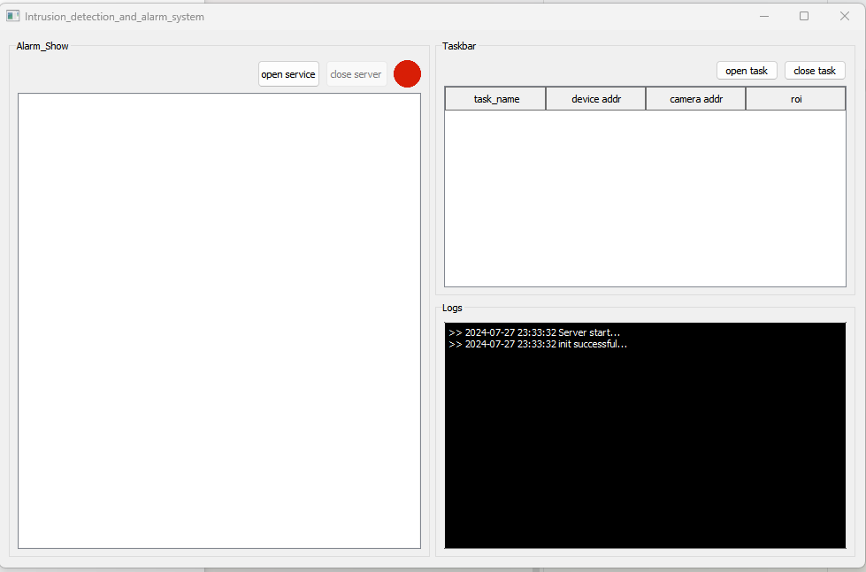
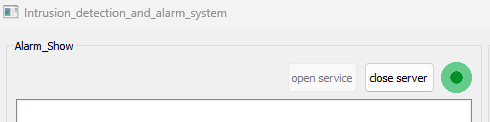
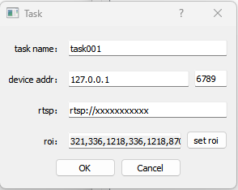
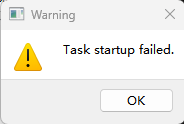
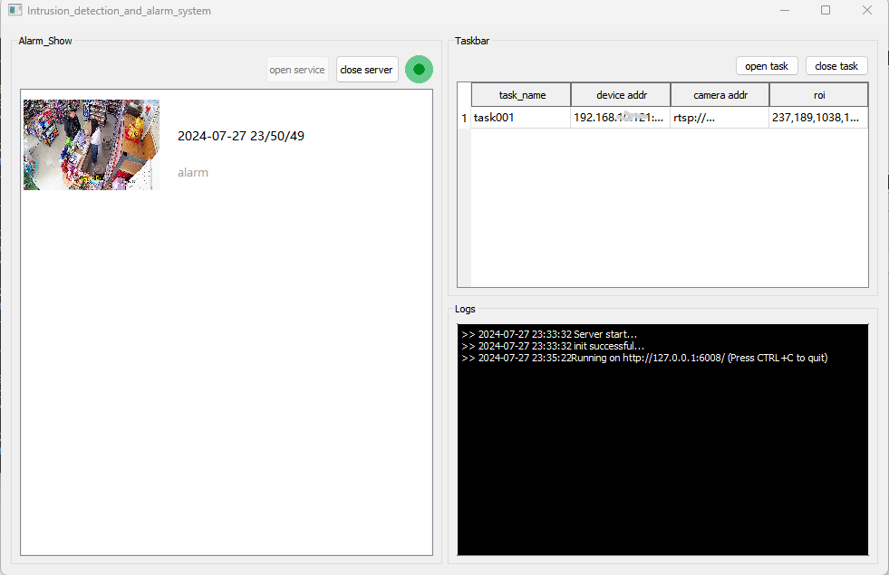

## 一、System Description
This warehouse serves as the upper computer control terminal for intrusion detection and alarm systems, as well as the upper computer program for displaying alarm information.

## Develop
Development tool:

1.Qt 5.14.1 (MSVC 2017, 32 bit)

Development language：C++11

## Compilation and execution：
Compile: Open the project using qtcreator and click compile to complete it.

Run: You can directly click on 'Run' in qtcreator, or package all dependent files into the program directory and click on 'Start Program' in the same way as packaging QT programs.

## The usage method is as follows：
①　Click on the ai_comtrol-system.exe program, and the program will run successfully as follows：

②　Click on 'Open Service' to start the software's HTTP receiving service, and the red prompt next to it will turn green：

③　Click on 'open task' to create a new task, as shown below：

You need to fill in the name of the task, the service address of the intelligent application, usually the IP and service port of the machine running the intelligent application. Fill in the RTSP stream address of the surveillance camera and set the area you want to focus on detecting for the current task. Finally, clicking OK will create the task. When your task fails, it will prompt you that the task creation has failed! As shown in the following figure：

④　When everything is normal, the system will operate normally. We can create some incidents of people inside the key monitoring area of the camera, and the system will report a warning to the backend service, as follows：

⑤　When you want to close this task, you can first click on the task with the mouse, such as task001, and then click the close task button to close the task.

